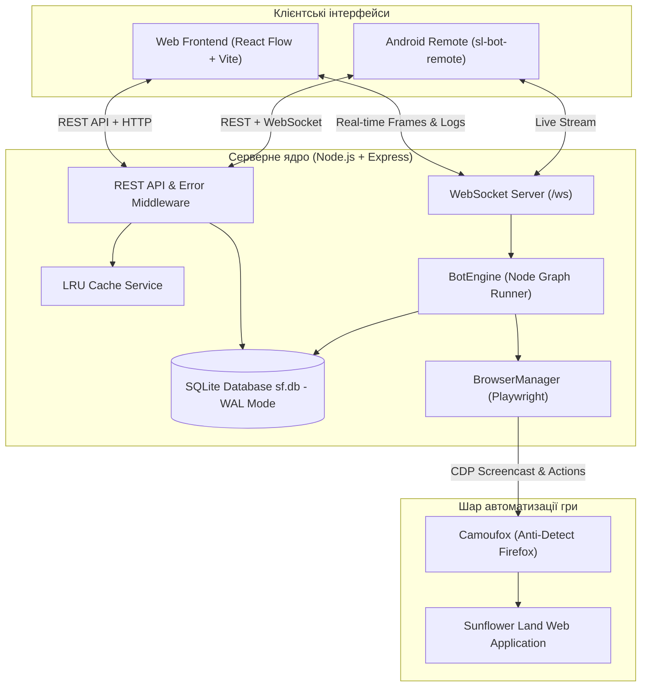

# 🌻 Sunflower Land Bot Constructor & Automation Platform

[](https://www.typescriptlang.org/)
[](https://nodejs.org/)
[](https://reactflow.dev/)
[](https://camoufox.com/)
[](https://www.sqlite.org/)
[](#ліцензія)

**Sunflower Land Bot Constructor** — це потужна модульна система для створення, візуального проєктування та запуску автоматизованих сценаріїв у блокчейн-грі **Sunflower Land**. Платформа поєднує сучасний інтерфейс візуального програмування на базі вузлів (node-based graphs) з антидетект-движком автоматизації браузера на базі Camoufox/Firefox, гнучким планувальником, аналітикою інвентарю та мобільним клієнтом для віддаленого контролю.

---

## 🎯 Призначення та ключові завдання

Браузерні крипто-ігри вимагають монотонних щоденних дій: посадки і збору врожаю, годування тварин, крафту інструментів, приготування страв та виконання щоденних доставки замовлень (deliveries). Ручна рутина забирає години часу, а звичайні скрипти автоматизації часто блокуються системами захисту від ботів або є занадто крихкими до змін інтерфейсу.

**Цей проєкт вирішує ці виклики:**
- **Візуальна розробка без коду:** Створюйте ланцюжки дій, розгалуження, цикли та умови у зручному drag-and-drop редакторі.
- **Непомітність для захисту (Антидетект):** Використання модифікованого браузера Camoufox (Firefox fork) з повною підміною відбитків (Canvas, WebGL, AudioContext, шрифти, заголовки, WebRTC).
- **Стійкість та надійність:** Вбудована черга повторних спроб (retry з експоненційним backoff), автоматична обробка помилок та збереження стану в SQLite (WAL mode).
- **Повний моніторинг:** Відеострімінг гри в реальному часі через Chrome DevTools Protocol (CDP), детальний аудит інвентарю ферми, розпізнавання міні-ігор на базі аналізу зображень.
- **Віддалене керування:** Контроль статусів, запуск/зупинка та перегляд стріму через Android-додаток або веб-панель.

---

## ⚡ Швидкий старт за 5 хвилин

### Варіант 1: Запуск через Docker Compose (Рекомендовано для серверів)

Найшвидший спосіб запустити повністю налаштоване середовище з бекендом, фронтендом та Nginx:

```bash
# 1. Клонуйте репозиторій або перейдіть у каталог проєкту
git clone https://github.com/Dimah98/DXDSF.git
cd DXDSF

# 2. Скопіюйте приклад конфігурації оточення
cp .env.example .env

# 3. Запустіть сервіси через Docker Compose
docker compose up -d --build

# 4. Перевірте статус контейнерів
docker compose ps
```

Після запуску сервіси будуть доступні за адресами:
- **Веб-панель (Frontend):** `http://localhost:5173`
- **Backend REST & WebSocket API:** `http://localhost:3001`
- **GoAccess Web Analytics:** `http://localhost:7880`

---

### Варіант 2: Локальний запуск для розробки

Якщо ви бажаєте розробляти нові ноди або змінювати інтерфейс:

#### Вимоги до оточення:
- **Node.js:** v20.x або вище
- **pnpm:** v8.x або v9.x (`npm install -g pnpm`)
- **Python:** 3.10+ (необхідний для роботи Camoufox)

#### Покрокова інструкція:

```bash
# 1. Встановлення залежностей усього монорепозиторію
pnpm install

# 2. Збірка спільних типів (shared-types)
pnpm --filter @sf/shared-types build

# 3. Встановлення браузера Camoufox
python -m pip install camoufox
python -m camoufox fetch

# 4. Запуск бекенду в режимі розробки
cd backend
pnpm dev

# 5. У новому терміналі — запуск фронтенду
cd frontend
pnpm dev
```

---

## ✨ Ключові можливості

| Модуль | Опис можливостей |
| :--- | :--- |
| **Редактор сценаріїв** | Вузловий візуальний конструктор на React Flow. Підтримка складних умов, циклів `Loop`, вкладених груп, кастомних дій з кліками та очікуваннями. |
| **Браузерне ядро Camoufox** | Спеціалізований Firefox-рушій з антидетектом: маскування фінгерпринтів, ізольовані профілі (`/profiles`), підтримка проксі та маніпуляцій з кукі. |
| **Live CDP Стрімінг** | Стрімінг гри з частотою 10-30 FPS напряму в інтерфейс за допомогою CDP Screencast API та передача через WebSocket без потреби у VNC. |
| **Interactive Selector Picker** | Вибір елементів гри в один клік прямо з вікна відеостріму для точного налаштування селекторів у нодах. |
| **Автономні Міні-ігри** | Модулі комп'ютерного зору та алгоритми проходження: `FruitRunner`, `WhackAMole`, `MemoryGame`, `SequenceMemory`. |
| **Аналітика інвентарю** | Автоматичний парсинг стану ферми: насіння, зібрані культури, ресурси, інструменти, будівлі та активні замовлення NPC. |
| **Планувальник та Mass Launch** | Запуск сценаріїв за розкладом або одночасне виконання ланцюжків для десятків ферм у паралельних браузерах. |
| **Кешування та відмовостійкість** | Швидкий In-Memory LRU кеш (`CacheService`), детальний моніторинг помилок (`ErrorMetrics`), збереження в базу даних SQLite WAL. |

---

## 🏛️ Високорівнева архітектура

Проєкт побудований за модульною клієнт-серверною архітектурою:



### Компоненти системи:
1. **[Web Frontend](file:///d:/SF%20k/frontend/README.md):** SPA на React 19 + TypeScript + Vite. Містить редактор графів React Flow, монітор потоків виконання, переглядач скріншотів та панелі налаштувань.
2. **[Backend Engine](file:///d:/SF%20k/backend/README.md):** Серверне ядро на Express. Відповідає за чергу завдань, виконання нод у топологічному порядку, керування життєвим циклом браузерів та збереження даних.
3. **[Shared Types](file:///d:/SF%20k/packages/shared-types/README.md):** Спільні контракти інтерфейсів та типів (TypeScript), що гарантують безпеку типізації між усіма частинами системи.
4. **Android Client (`sl-bot-remote`):** Нативний додаток на Kotlin/Compose для моніторингу ферм, запуску сценаріїв та отримання сповіщень на смартфон.

---

## 📁 Структура проєкту

```text
.
├── backend/                # Серверна частина: Express, Playwright, SQLite
│   ├── src/
│   │   ├── controllers/    # Контролери REST API
│   │   ├── engine/         # Рушій виконання графів сценаріїв (BotEngine)
│   │   ├── nodes/          # Реєстр та реалізація всіх нод автоматизації
│   │   ├── runner/         # Масовий планувальник (MassLaunchRunner)
│   │   ├── cache/          # In-Memory LRU кеш сервіс
│   │   ├── errors/         # Ієрархія класів помилок (AppError)
│   │   └── websocket/      # Сервер WebSocket та трансляція CDP
│   └── data/               # База даних SQLite (sf.db)
├── frontend/               # Клієнтська частина: React, React Flow, Vite
│   ├── src/
│   │   ├── components/     # UI компоненти та модальні вікна
│   │   │   ├── CustomNodes/# Візуальне представлення кастомних нод
│   │   │   └── Modals/     # Вікна інвентарю, аналітики, логів
│   │   ├── hooks/          # React-хуки (WebSocket, історія, збереження)
│   │   └── store/          # Zustand стори стану додатку
├── packages/
│   └── shared-types/       # Спільні TypeScript інтерфейси для Backend, Frontend та Mobile
├── sl-bot-remote/          # Мобільний додаток віддаленого контролю (Android / Kotlin)
├── docs/                   # Розширена технічна документація
│   ├── ARCHITECTURE.md     # Глибока технічна архітектура та діаграми
│   ├── API.md              # Повний довідник REST API та WebSocket протоколу
│   ├── DEPLOYMENT.md       # Інструкції з розгортання (Docker, CasaOS, VPS)
│   ├── DEVELOPMENT.md      # Інструкція для розробників та стандарти коду
│   └── SECURITY.md         # Політика безпеки, токени та захист профілів
├── docker-compose.yml      # Базовий конфіг контейнеризації
└── docker-compose.casaos.yml # Шаблон для легкого розгортання в CasaOS
```

---

## 📚 Детальна документація

Для глибшого вивчення конкретних частин платформи зверніться до спеціалізованих розділів:

- 🏗️ **[Архітектура системи (`docs/ARCHITECTURE.md`)](file:///d:/SF%20k/docs/ARCHITECTURE.md):** Повний огляд внутрішніх механізмів, життєвого циклу сесій, захисту від блокувань та пайплайнів обробки.
- 📡 **[Довідник API (`docs/API.md`)](file:///d:/SF%20k/docs/API.md):** Огляд усіх ендпоінтів та інтерактивної Swagger UI документації.
- 📄 **[OpenAPI 3.0 Специфікація (`docs/openapi.yaml`)](file:///d:/SF%20k/docs/openapi.yaml):** Машиночитана специфікація REST API для імпорту та валідації.
- 🔌 **[WebSocket Протокол (`docs/websocket-protocol.md`)](file:///d:/SF%20k/docs/websocket-protocol.md):** Детальний опис взаємодії в реальному часі, життєвий цикл стріму, payload schemas та коди помилок.
- 📮 **[Postman Колекція (`docs/postman_collection.json`)](file:///d:/SF%20k/docs/postman_collection.json):** Готова колекція запитів для швидкого тестування в Postman / Insomnia.
- 🤖 **[Генерація клієнтських SDK (`docs/CLIENT_GENERATION.md`)](file:///d:/SF%20k/docs/CLIENT_GENERATION.md):** Автоматична генерація клієнтів для TypeScript (Web), Kotlin (Android) та Python.
- 🚢 **[Посібник з розгортання (`docs/DEPLOYMENT.md`)](file:///d:/SF%20k/docs/DEPLOYMENT.md):** Налаштування на VPS, робота з CasaOS, ротація логів, резервне копіювання даних та усунення проблем.
- 💻 **[Гайд для розробників (`docs/DEVELOPMENT.md`)](file:///d:/SF%20k/docs/DEVELOPMENT.md):** Створення власних кастомних нод, конвенції оформлення коду, запуск тестів та робота з гілками.
- 🛡️ **[Безпека та конфіденційність (`docs/SECURITY.md`)](file:///d:/SF%20k/docs/SECURITY.md):** Ізоляція сесій, зберігання облікових записів Web3, шифрування та запобігання витокам.

---

## 📄 Ліцензія

Проєкт створено для приватного використання в цілях дослідження та автоматизації ігрових процесів. Всі права захищено.
