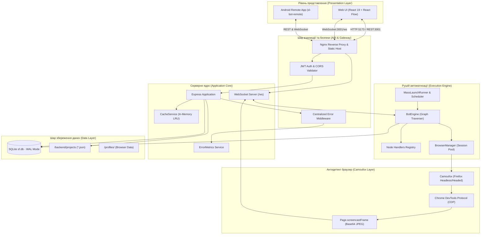
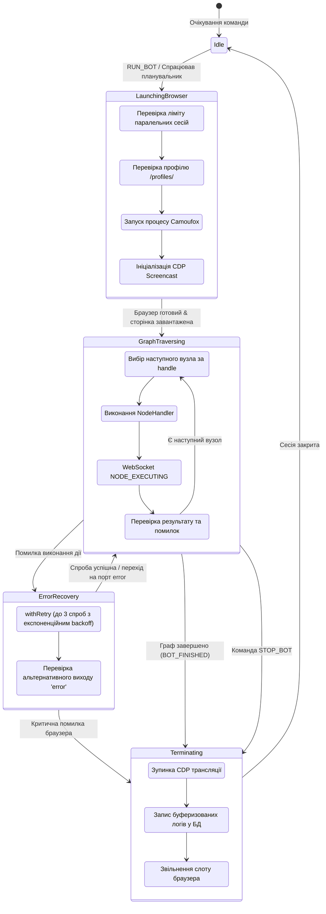

# 🏛️ Технічна архітектура системи Sunflower Land Bot

Цей документ містить поглиблений опис технічної архітектури, взаємодії підсистем, життєвого циклу процесів та механізмів надійності платформи **Sunflower Land Bot Constructor & Runner**.

---

## 📐 Загальна архітектурна схема

Платформа побудована за модульною мікро-сервісною моделлю, оптимізованою для високої швидкодії та ізоляції завдань:



---

## 🔄 Потік даних (Data Flow)

Потік обробки сценарію проходить такі стадії:

1. **Конструювання графа:** Користувач формує візуальний граф дій у React Flow на фронтенді (вузли дій, умов, циклів) та зберігає його через REST API (`PUT /api/projects/:name/saves/main`).
2. **Кешування та збереження:** Сервер зберігає проект як у базу даних SQLite (таблиці `project_saves` та `project_contents`), так і дублює у файл JSON для надійності. Кеш `projects:*` інвалідується.
3. **Старт виконання:**
   - Користувач натискає **"Запустити"** у веб-панелі або спрацьовує планувальник `MassLaunchRunner`.
   - Клієнт надсилає WebSocket повідомлення `{ type: 'RUN_BOT', nodes: [...], edges: [...] }`.
4. **Ініціалізація браузера:**
   - `BrowserManager.getOrCreateSession(projectName)` перевіряє ліміти семафора (`MAX_PARALLEL_BROWSERS`).
   - Запускається ізольований бінарник Camoufox із збереженим профілем користувача (`/profiles/<projectName>`).
   - Підключається сесія CDP, ініціюється підписка на подію `Page.screencastFrame` для стрімінгу картинки гри клієнту.
5. **Обхід графа (Execution Pipeline):**
   - `BotEngine` починає виконання з початкового вузла (`startNode`).
   - На кожному кроці викликається зареєстрований обробник `NodeHandler(context, data)` з `src/nodes/`.
   - За допомогою WebSocket відправляється подія `NODE_EXECUTING` з підсвічуванням поточної ноди на екрані користувача.
   - Обробник виконує дію (клік мишею, перевірка селектора, очікування, аналіз зображення з полотна Canvas гри).
   - Результат `NodeResult` повертає ідентифікатор виходу (`nextHandle`), за яким рушій знаходить наступний вузол графа.
6. **Завершення сесії:**
   - Коли досягнуто кінця гілки графа, відправляється подія `BOT_FINISHED`.
   - Усі зібрані метрики, інвентар та логи записуються в SQLite.

---

## 🔁 Життєвий цикл бота та браузера



---

## 🛡️ Підсистема надійності та відмовостійкості

### 1. Централізована повторна спроба (`withRetry`)
Для боротьби з мережевими затримками та лагами сторінки браузера всі критичні операції використовують утиліту `src/utils/retry.ts`:
```typescript
await withRetry(
  async () => await page.click(selector),
  {
    maxAttempts: 3,
    initialDelayMs: 500,
    backoffFactor: 2,
    jitter: true,
    onRetry: (err, attempt) => logger.warn(`Повторна спроба #${attempt}: ${err.message}`)
  }
);
```

### 2. Захист від втрати даних при аварійному зупині (Graceful Shutdown)
При отриманні сигналів операційної системи `SIGINT` або `SIGTERM`:
1. Зупиняється прийом нових запитів HTTP та WebSocket.
2. Негайно викликається `flushPendingLogs()` для запису всіх буферизованих логів на диск.
3. Проводиться плавне закриття всіх активних екземплярів Camoufox (`browser.close()`), зберігаючи кукі та сесії гри.
4. Закриваються пули транзакцій SQLite WAL: `db.pragma('wal_checkpoint(TRUNCATE)')`.
5. Процес виходить з кодом `0`.

### 3. Багаторівневе кешування (`CacheService`)
Кеш працює за патерном **Cache-Aside**:
- Звернення до часто запитуваних даних (список проектів, останні логи, загальна статистика інвентарю) спочатку перевіряють In-Memory LRU сховище.
- При операціях мутації (створення/редагування/видалення) спрацьовує інвалідація ключів за масками (наприклад, `cache.delPattern('projects:*')`).
- Час відповіді на типові запити скоротився з 50-100мс до < 1мс.

### 4. Ротація логів
- Логер використовує захищену функцію серіалізації `safeStringify` для уникнення помилок `TypeError: Converting circular structure to JSON`.
- Логи Docker-контейнерів обмежені на рівні `docker-compose.yml`: максимальний розмір файлу — **50 MB**, кількість архівів — **5** (максимальний обсяг дисків під логи — 250 MB).
