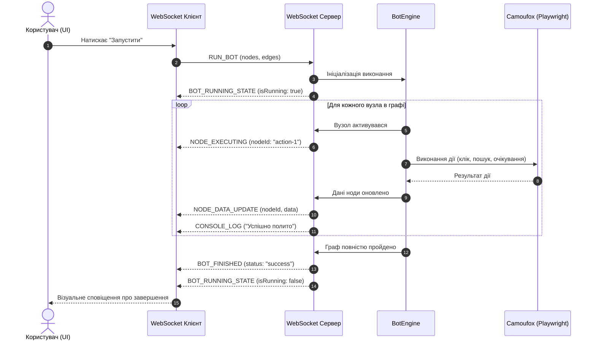
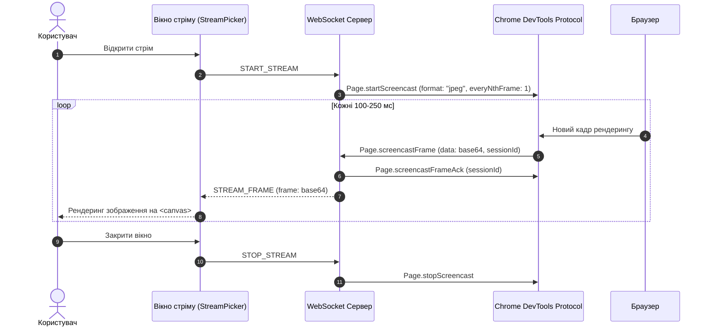
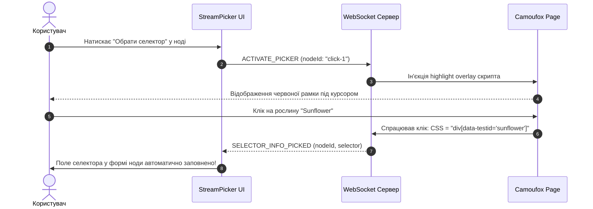
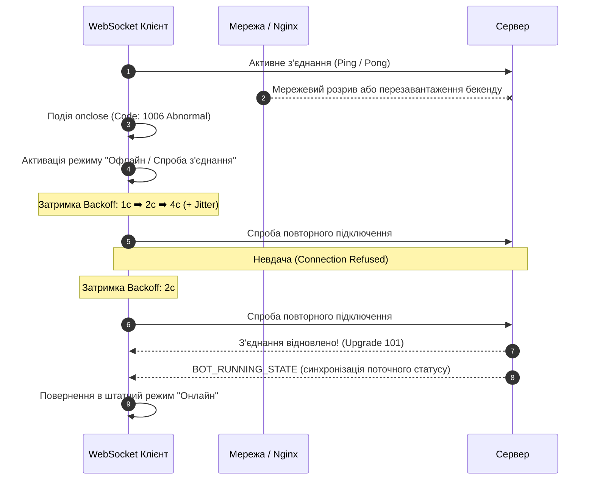

# 🔌 Специфікація WebSocket Протоколу (WebSocket Protocol Documentation)

Цей документ містить повний технічний опис протоколу двосторонньої комунікації через **WebSocket** між серверним ядром (Backend), веб-панеллю (Frontend) та мобільним додатком (`sl-bot-remote`).

---

## 🌐 1. Життєвий цикл з'єднання (Connection Lifecycle)

### 1.1 Точка підключення (Handshake URL)
Клієнт ініціює з'єднання за адресою:
```text
ws://<HOST>:3001/ws?project={projectName}&token={jwtToken}
```
Або через захищений TLS тунель:
```text
wss://<DOMAIN>/ws?project={projectName}&token={jwtToken}
```

#### Параметри запиту (Query Parameters):
- `project` *(string, обов'язковий)*: Назва проекту ферми (наприклад, `Farm_Main`). Визначає, до якої сесії браузера та логів підключається сокет.
- `token` *(string, опціональний у dev / обов'язковий у prod)*: JWT токен автентифікації користувача.

### 1.2 Автентифікація та Ініціалізація
1. Сервер валідує JWT токен під час обробки HTTP Upgrade запиту.
2. При успішній перевірці сокет додається до пулу підписників проекту `session.subscribers`.
3. Сервер негайно надсилає клієнту початковий стан:
   - Поточний статус роботи: `BOT_RUNNING_STATE` (`isRunning: true/false`).
   - Актуальний CSRF токен: `CSRF_TOKEN` (необхідний для наступних REST-запитів).
   - Останні значення глобальних змінних: `GLOBAL_VARIABLES_UPDATE`.

### 1.3 Логіка повторного підключення (Reconnection Strategy)
Якщо з'єднання розірвано мережею чи перезапуском контейнера, клієнт застосовує стратегію **експоненційного backoff з рандомізацією (jitter)**:
- Початкова затримка: **1000 мс**
- Множник зростання: **1.5x**
- Максимальна затримка: **30 000 мс**
- Jitter: випадкове коливання `±20%` для запобігання thundering herd problem.

---

## 📤 2. Повідомлення від Клієнта до Сервера (Client ➡️ Server)

### 2.1 Керування сценаріями та виконанням

#### `RUN_BOT` — Запуск повного графа дій
```json
{
  "type": "RUN_BOT",
  "node": { "id": "start-1" },
  "nodes": [
    {
      "id": "start-1",
      "type": "startNode",
      "position": { "x": 100, "y": 100 },
      "data": {}
    }
  ],
  "edges": [
    {
      "id": "e1",
      "source": "start-1",
      "target": "crop-1",
      "sourceHandle": "out",
      "targetHandle": "in"
    }
  ]
}
```

#### `RUN_SINGLE_NODE` — Запуск одного виділеного вузла для тесту
```json
{
  "type": "RUN_SINGLE_NODE",
  "nodeId": "water-crops-2",
  "nodes": [...],
  "edges": [...]
}
```

#### `RUN_GROUP` — Запуск ізольованої підгрупи вузлів
```json
{
  "type": "RUN_GROUP",
  "groupId": "group-crops-block",
  "nodes": [...],
  "edges": [...]
}
```

#### `STOP_BOT` — Негайна зупинка виконання
```json
{
  "type": "STOP_BOT"
}
```

---

### 2.2 Керування браузером та стрімінгом

#### `START_STREAM` / `STOP_STREAM` — Увімкнення/вимкнення трансляції екрану
```json
{
  "type": "START_STREAM"
}
```

#### `LAUNCH_BROWSER` / `CLOSE_BROWSER` — Ручне відкриття або закриття вікна Camoufox
```json
{
  "type": "LAUNCH_BROWSER"
}
```

#### `INTERACT_BROWSER` — Клік або взаємодія з екраном гри
Дозволяє користувачеві клікнути або ввести текст у гру прямо через вікно стріму:
```json
{
  "type": "INTERACT_BROWSER",
  "action": "click",
  "x": 450,
  "y": 320
}
```
*Підтримувані дії (`action`):* `'click'`, `'dblclick'`, `'move'`, `'scroll'`, `'key'`, `'escape'`.

#### `ACTIVATE_PICKER` / `CANCEL_PICKER` — Режим вибору селектора елемента
```json
{
  "type": "ACTIVATE_PICKER",
  "nodeId": "action-node-5"
}
```

#### `UPDATE_VARIABLE` — Оновлення глобальної змінної проекту
```json
{
  "type": "UPDATE_VARIABLE",
  "name": "targetCrop",
  "value": "Sunflower"
}
```

#### `OPEN_DEVTOOLS` — Отримання посилання на сесію CDP DevTools
```json
{
  "type": "OPEN_DEVTOOLS"
}
```

---

## 📥 3. Повідомлення від Сервера до Клієнта (Server ➡️ Client)

### 3.1 Статус виконання та підсвічування

#### `BOT_RUNNING_STATE` — Зміна активності бота
```json
{
  "type": "BOT_RUNNING_STATE",
  "isRunning": true
}
```

#### `NODE_EXECUTING` — Поточна активна нода (для UI highlight)
```json
{
  "type": "NODE_EXECUTING",
  "nodeId": "water-crops-2",
  "nodeTitle": "Полив рослин",
  "parentGroupId": "group-crops-block"
}
```

#### `NODE_DATA_UPDATE` — Оновлення даних або результату ноди
```json
{
  "type": "NODE_DATA_UPDATE",
  "nodeId": "water-crops-2",
  "data": {
    "wateredCount": 18,
    "lastActionTime": 1727738400000
  }
}
```

#### `BOT_FINISHED` — Завершення виконання сценарію
```json
{
  "type": "BOT_FINISHED",
  "status": "success",
  "durationMs": 45200,
  "summary": {
    "harvested": 24,
    "planted": 24
  }
}
```

---

### 3.2 Відеопотік та Дебаг

#### `STREAM_FRAME` — Кадр трансляції CDP (Base64 JPEG)
Транслюється з періодичністю 100–250 мс під час активного стріму:
```json
{
  "type": "STREAM_FRAME",
  "frame": "/9j/4AAQSkZJRgABAQEASABIAAD/2wBDAP//////////////////////////////////////////////////////////////////////////////////////wgALCA..."
}
```

#### `DEBUG_SNAPSHOT` — Відладковий скріншот з відміченими координатами
```json
{
  "type": "DEBUG_SNAPSHOT",
  "image": "data:image/png;base64,...",
  "coords": { "x": 420, "y": 310 },
  "label": "Виявлено об'єкт Sunflower"
}
```

#### `CONSOLE_LOG` — Лог виконання
```json
{
  "type": "CONSOLE_LOG",
  "message": "[Farm_Main] Збір врожаю успішно завершено",
  "logType": "success",
  "timestamp": 1727738401200
}
```

#### `SELECTOR_INFO_PICKED` — Результат інтерактивного кліку DOM Picker
```json
{
  "type": "SELECTOR_INFO_PICKED",
  "nodeId": "action-node-5",
  "selector": "div[data-testid=\"crop-sunflower\"]",
  "tagName": "DIV",
  "rect": { "x": 340, "y": 210, "width": 48, "height": 48 }
}
```

#### `CSRF_TOKEN` — Оновлення токена безпеки
```json
{
  "type": "CSRF_TOKEN",
  "token": "d98f7e2a4b1c8f5e"
}
```

---

## 🚨 4. Коди помилок та обробка збоїв (Error Handling)

WebSocket сервер використовує діапазон кодів завершення **4000–4999** відповідно до RFC 6455:

| Код | Назва | Опис | Дія клієнта |
| :--- | :--- | :--- | :--- |
| `4001` | `UNAUTHORIZED` | Відсутній або недійсний JWT токен. | Перенаправити на логін / оновити токен. |
| `4002` | `PROJECT_NOT_FOUND` | Зазначений проект не існує на сервері. | Показати помилку, не реконнектитися. |
| `4003` | `BROWSER_CRASH` | Процес Camoufox аварійно вилетів. | Показати сповіщення, повторити запуск. |
| `4004` | `CONCURRENCY_LIMIT` | Досягнуто ліміту одночасних браузерів (`MAX_PARALLEL_BROWSERS`). | Поставити проект у чергу. |
| `4005` | `GRAPH_VALIDATION_ERROR`| У графі відсутня стартова нода або є циклічний зв'язок без затримки. | Підсвітити проблемний вузол. |
| `4008` | `STREAM_RATE_LIMITED` | Занадто висока частота запитів кадрів від клієнта. | Знизити FPS. |

---

## 📊 5. Flow-діаграми сценаріїв (Mermaid)

### 5.1 Запуск проекту ➡️ Виконання графа ➡️ Завершення



---

### 5.2 Життєвий цикл Live Streaming через CDP



---

### 5.3 Інтерактивний вибір селектора (DOM Picker Flow)



---

### 5.4 Відновлення при збої з'єднання (Error Recovery Flow)


